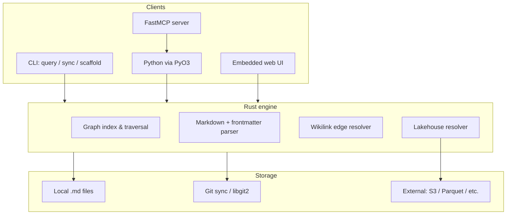

# MagGraph — Architecture Reference

Condensed from [`PRD.md`](../PRD.md). Use this for orientation; the PRD remains canonical for product decisions.

## Core concept

MagGraph is an **embedded graph database** where:

- **Nodes** are Markdown files with YAML frontmatter (metadata, type, external source pointers).
- **Edges** are **implicit** from `[[wikilinks]]` in node body text.
- **Persistence** is file-system + **Git** (`libgit2`) for versioned, distributable state.
- **Consumers** are primarily **LLM agents** — query results and reports are Markdown-oriented.

## Data model

### Node (Markdown file)

- **Frontmatter:** `id`, `type`, optional `source` / `source_uri`, `importance`, explicit `links`, etc.
- **Body:** Human-readable content; wikilinks define additional edges.
- **Modes:**
  - **Local:** Full content stored in-repo under configured `root_path`.
  - **Lakehouse:** Node is a **semantic pointer**; content resolved at read time from `source` / remote config.

### Edge

- Parsed from `[[target]]` (and variants) in markdown body.
- Optional explicit `links` in frontmatter (per PRD example).

## Sync topology

| Role | Writes | Reads | Notes |
|------|--------|-------|-------|
| **Leader** | Yes | Yes | Holds `lock.toml` to serialize writes |
| **Follower** | No (read-only clone) | Yes | Syncs from `remote_url` |

Conflict handling: **Git-native** tree merge; leader serializes writes via lock file.

## Agent integration surface

| Surface | Mechanism |
|---------|-----------|
| Python API | PyO3 + `pyo3-asyncio` for async agent loops |
| Tool manual | Auto-generated `SKILL.md` per graph instance |
| MCP | `maggraph scaffold --mcp` → FastMCP server from schema |
| Query output | Markdown-formatted traversal reports for LLM context |

## Configuration (`maggraph.toml`)

Sections (from PRD):

- `[storage]` — `mode` (`local` \| `lakehouse`), `root_path`
- `[lakehouse]` — `remote_sources` (URI, format)
- `[sync]` — `role` (`leader` \| `follower`), `remote_url`

## Non-functional targets (from PRD)

- Sub-millisecond **local** graph traversal where feasible.
- **mmap**-oriented storage for hot paths.
- Atomic, versioned state via Git sync.

## Out of scope for v0 (suggested)

Document explicitly in PROGRESS if deferred:

- Multi-leader writes
- Non-Git replication backends
- Full SQL/graph query language (start with traversal + Markdown reports)
