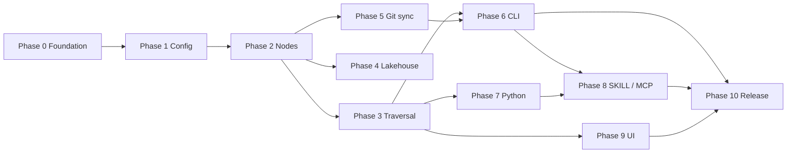

# MagGraph — Implementation Plan

Phased roadmap to implement the product described in [`PRD.md`](../PRD.md). Each phase lists **goals**, **tasks**, **deliverables**, and **acceptance criteria**. Update [`PROGRESS.md`](./PROGRESS.md) as tasks complete.

---

## Phase 0 — Repository & project foundation

**Goal:** Runnable Rust workspace, CI, and conventions before feature code.

| ID | Task | Notes |
|----|------|-------|
| 0.1 | Initialize Cargo workspace (`maggraph` lib + binaries) | `cdylib` for Python later |
| 0.2 | Add core dependencies (serde, yaml, markdown parser, thiserror, tracing) | Pin versions in workspace |
| 0.3 | Add `libgit2` / `git2` crate integration stub | Feature-gate if needed |
| 0.4 | Define error types and logging/tracing setup | Structured logs for CLI |
| 0.5 | CI: `fmt`, `clippy`, `test` on push | GitHub Actions |
| 0.6 | Contributor docs: build, test, layout | Extend root README |

**Deliverables:** `cargo build`, `cargo test`, CI green on empty/minimal crate.

**Acceptance:** New clone builds and runs `maggraph --help` (stub subcommands OK).

---

## Phase 1 — Configuration & filesystem layout

**Goal:** Load `maggraph.toml` and resolve storage paths.

| ID | Task | Notes |
|----|------|-------|
| 1.1 | TOML schema for `[storage]`, `[lakehouse]`, `[sync]` | Match PRD example |
| 1.2 | Config validation (mode, role, paths exist or creatable) | Clear error messages |
| 1.3 | Initialize graph root: `.maggraph/` metadata dir optional | Document layout |
| 1.4 | Example `maggraph.toml` + sample graph in `examples/` | For manual testing |

**Deliverables:** Config loader crate module, example config.

**Acceptance:** Unit tests load valid/invalid configs; example path resolves `root_path`.

---

## Phase 2 — Markdown node model & index

**Goal:** Ingest nodes from `.md` files; parse frontmatter and body.

| ID | Task | Notes |
|----|------|-------|
| 2.1 | Frontmatter parser (YAML) → typed `Node` struct | `id`, `type`, `source`, `links`, extensions |
| 2.2 | Watch / scan `root_path` for `*.md` nodes | Full rescan + incremental (later) |
| 2.3 | In-memory index: `id` → path, metadata | Prepare for mmap in Phase 3 |
| 2.4 | Node CRUD (create, read, update, delete) on filesystem | Leader-only enforcement later |
| 2.5 | Round-trip: edit node → serialize consistent markdown | Preserve unknown frontmatter keys |

**Deliverables:** `Node`, `GraphIndex` (working name), scan + CRUD API.

**Acceptance:** Tests create nodes from PRD example schema; reload preserves fields.

---

## Phase 3 — Edges, traversal & performance

**Goal:** Wikilink edges and fast local traversals.

| ID | Task | Notes |
|----|------|-------|
| 3.1 | Wikilink regex / parser (`[[page]]`, aliases if needed) | Document supported syntax |
| 3.2 | Merge frontmatter `links` + body wikilinks into adjacency | Directed vs undirected: document choice |
| 3.3 | Traversal API: neighbors, BFS/DFS to depth N | Return node ids + paths |
| 3.4 | mmap or memory-mapped index for hot adjacency (if warranted) | Benchmark before/after |
| 3.5 | Markdown report formatter for traversal results | LLM-friendly sections |

**Deliverables:** `traverse(from, depth)` → internal struct + `to_markdown()`.

**Acceptance:** Example graph traverses in &lt;1ms locally on small fixture (smoke benchmark).

---

## Phase 4 — Lakehouse mode

**Goal:** Nodes as pointers to external assets; resolve content on demand.

| ID | Task | Notes |
|----|------|-------|
| 4.1 | `storage.mode = lakehouse` branch in read path | Local mode unchanged |
| 4.2 | Resolve `source` / `source_uri` from node + `[lakehouse].remote_sources` | Prefix / URI rules |
| 4.3 | Pluggable resolver trait: `file://`, `s3://` stub → real S3 later | Start with file/http stub |
| 4.4 | Parquet preview or metadata-only read (MVP) | Full analytics out of scope |
| 4.5 | Cache policy for external fetches (TTL, size cap) | Configurable |

**Deliverables:** `ContentResolver`, lakehouse read API.

**Acceptance:** Node with `source: s3://...` returns resolved snippet or metadata in tests (mocked S3).

---

## Phase 5 — Git sync & roles

**Goal:** Versioned replication; leader/follower semantics.

| ID | Task | Notes |
|----|------|-------|
| 5.1 | Git repo init / attach at `root_path` or configured remote | libgit2 |
| 5.2 | `sync` command: pull, push, status | Match `[sync].remote_url` |
| 5.3 | `lock.toml` on leader: acquire/release for writes | Followers reject writes |
| 5.4 | Role enforcement in CRUD + CLI | `role = follower` read-only |
| 5.5 | Conflict documentation + basic merge strategy | Git-native; test merge fixture |

**Deliverables:** `maggraph sync`, lock file protocol doc in planning or main docs.

**Acceptance:** Two-directory test: leader writes + push; follower pull + read-only write fails.

---

## Phase 6 — CLI

**Goal:** User-facing commands from PRD.

| ID | Task | Notes |
|----|------|-------|
| 6.1 | `maggraph query` — traversal + markdown output | Config path flag |
| 6.2 | `maggraph sync` — wrap Phase 5 | |
| 6.3 | `maggraph scaffold --mcp` — stub then generator | Phase 7 ties in |
| 6.4 | Global flags: `--config`, `-v` / tracing | |
| 6.5 | Shell completion (optional) | Nice-to-have |

**Deliverables:** Binary `maggraph` with subcommands.

**Acceptance:** Integration test runs `query` against example graph, golden markdown snapshot.

---

## Phase 7 — Python bindings (PyO3)

**Goal:** Async-friendly Python API for agents.

| ID | Task | Notes |
|----|------|-------|
| 7.1 | `pyo3` module exposing index, traverse, node read | `maturin` or `setuptools-rust` |
| 7.2 | `pyo3-asyncio` for non-blocking traverse/read | Document event loop requirements |
| 7.3 | Type stubs / `py.typed` | |
| 7.4 | Publish workflow: wheel build in CI | |
| 7.5 | Minimal Python example script | `examples/python_agent.py` |

**Deliverables:** `maggraph` Python package on top of Rust core.

**Acceptance:** pytest calls traverse from Python; asyncio example runs without blocking loop.

---

## Phase 8 — Agent artifacts (SKILL.md & MCP scaffold)

**Goal:** Machine-readable tool surface for LLM agents.

| ID | Task | Notes |
|----|------|-------|
| 8.1 | Introspect graph schema: node types, edge patterns | From index |
| 8.2 | Generate / update `SKILL.md` on graph init or `scaffold` | Machine-readable manual |
| 8.3 | `scaffold --mcp`: emit FastMCP Python server | Tools map to traverse/CRUD |
| 8.4 | Document MCP deployment | README section |

**Deliverables:** Generated `SKILL.md` template; `mcp_server/` scaffold output.

**Acceptance:** Generated MCP server starts (smoke test); SKILL lists available operations.

---

## Phase 9 — Embedded local UI

**Goal:** Web dashboard for audit and manual CRUD.

| ID | Task | Notes |
|----|------|-------|
| 9.1 | HTTP server (e.g. `axum` + `tower`) embedded in binary or feature flag | `maggraph ui` |
| 9.2 | REST/JSON API: list nodes, edges, get node, patch node | |
| 9.3 | Static frontend or minimal HTMX pages | Graph view nice-to-have |
| 9.4 | Auth: local-only bind `127.0.0.1` for MVP | |

**Deliverables:** `maggraph ui` serves dashboard.

**Acceptance:** Browser can list nodes and open one markdown body from example graph.

---

## Phase 10 — Hardening & release

**Goal:** Production-minded v0.1.

| ID | Task | Notes |
|----|------|-------|
| 10.1 | Integration test suite across phases | |
| 10.2 | Benchmarks published in CI or docs | Traversal latency |
| 10.3 | Security review: path traversal, SSRF on lakehouse URIs | |
| 10.4 | Versioning, CHANGELOG, license | |
| 10.5 | Release binaries + Python wheels | |

**Deliverables:** Tagged release `v0.1.0`.

**Acceptance:** Documented install path; smoke test from clean environment.

---

## Dependency graph (phases)

## Suggested first implementation slice (MVP)

Minimum useful product for early dogfooding:

1. Phases **0 → 3** (local mode only)
2. Phase **6.1** (`query` only)
3. Phase **8.1** (basic `SKILL.md`)

Defer lakehouse, sync, UI, and MCP until local graph + query path is stable.

---

## Post-v0.1 — v0.1.1+ hardening

Phases 0–10 delivered **v0.1.0**. Follow-up work is **not** numbered as new phases; it lives in [`BACKLOG.md`](./BACKLOG.md):

| Track | Examples | IDs |
|-------|----------|-----|
| Test coverage | UI CRUD, MCP CRUD, CLI edge cases | `T-H*`, `T-M*` |
| Documentation | `examples/README`, CONTRIBUTING, OpenAPI | `D-*` |
| CI quality | Clippy feature parity, coverage, bench gate | `C-L*`, `T-L*` |
| PRD gaps | Real HTTP/S3 fetch, Python lakehouse, mmap | `T-F*` |

Use [`TESTING.md`](./TESTING.md) for how to run tests and [`IMPLEMENTATION_STATUS.md`](./IMPLEMENTATION_STATUS.md) for PRD vs shipped behavior.

## Risk register

| Risk | Mitigation |
|------|------------|
| Wikilink ambiguity (titles vs paths) | Document resolution rules; slugify ids |
| libgit2 build complexity | CI matrix; optional `vendored` feature |
| Lakehouse SSRF / credential leaks | Allowlist schemes; no arbitrary redirects |
| MCP schema drift | Regenerate on `scaffold`; version in SKILL frontmatter |
